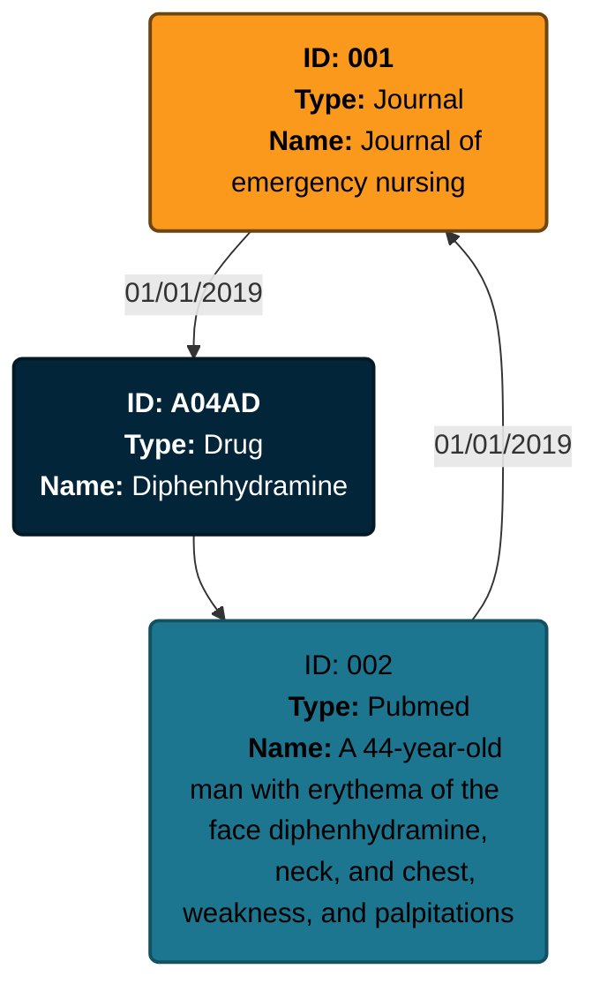

# Test technique DE Servier

> **Auteur:** Alexandre Bidon
> Data Engineer @ LittleBigCode

- [Test technique DE Servier](#test-technique-de-servier)
  - [Partie 1: Python et Data Engineering](#partie-1-python-et-data-engineering)
    - [Format du résultat JSON](#format-du-résultat-json)
      - [Première version](#première-version)
      - [Deuxième version](#deuxième-version)
        - [Exemple](#exemple)
      - [Troisième version (finale)](#troisième-version-finale)
        - [Exemple](#exemple-1)
    - [Stockage des données](#stockage-des-données)
    - [Implémentation de la pipeline python](#implémentation-de-la-pipeline-python)
      - [Structure du projet](#structure-du-projet)
    - [Importation des données](#importation-des-données)
    - [Nettoyage des données](#nettoyage-des-données)
    - [Traitement des données](#traitement-des-données)
    - [Résultat](#résultat)
  - [Partie 2: SQL](#partie-2-sql)
    - [Première requête](#première-requête)
    - [Deuxième requête](#deuxième-requête)

## Partie 1: Python et Data Engineering

### Format du résultat JSON

#### Première version

Avant de préparer le pipeline de traitement de données, j'ai défini le format du JSON de sortie. Ma première version se présentait de la manière suivante:

```JSON
{
    "name": "graphe médicament servier",
    "date": "date de l'output",
    "nodes": [
        {
            // Le type de la node
            // journal | pubmed | drug | clinical_trial
            "type": "", 
            // Le nom de la node, dépend du type de la node
            // Le titre du journal | Le nom de la publication | Le nom du médicament | Le nom de l'essai clinique
            "name": ""
        }
    ],
    "links": [
        {
            "from": "",
            "to": "",
            // La date de la mention
            "date": ""
        }
    ]
}
```

Ce format convient pour l'exercice, il est simple à mettre en place. Cependant, il comporte de nombreux défauts:

- Le format ne scale pas très bien avec un grand nombre de nodes et de links
- Les nodes n'ont pas d'identifiant unique, deux nodes pourraient avoir le même nom et elles seraient alors indistinguable.
- La recherche de lien entre plusieurs nodes serait longue et fastidieuse. Il faudrait traverser toute la liste des *links* pour trouver les liens des nodes concernées.
- Les liens entre les *Drugs* et les *PubMeds* / *Clinical trials* n'ont pas de date. On mélange donc des liens avec des formats différents. Le format n'est pas robuste et ne scale pas bien.

J'ai donc modifié mon format afin de répondre à ces différents problèmes.

#### Deuxième version

Cet deuxième version a été concu pour scale avec un plus grand nombre de node et pour faciliter l'idenfication d'une node. Toutes les nodes ont désormais un ID unique. Les liens des nodes sont directements référencés dans celle-ci. Il est donc plus facile de naviguer de node en node.

```JSON
{
    "name": "graphe médicament servier",
    "date": "date de l'output",
    "nodes": [
        {
            // Le type de la node
            // journal | pubmed | drug | clinical_trial
            "type": "", 
            // Identifiant de la node
            "id": "",
            // Le nom de la node, dépend du type de la node
            // Le titre du journal | Le nom de la publication | Le nom du médicament | Le nom de l'essai clinique
            "label": "",
            //
            "ref": [
                {
                    "id": "L'id de la node",
                    // La date de la mention
                    "date": ""
                }
            ]
        }
    ]
}
```

##### Exemple

Pour illustrer le choix du format, j'ai réalisé un output d'exemple:

```JSON
{
    "name": "graphe médicament servier",
    "date": "01/02/2024",
    "nodes": [
        {
            "type": "journal", 
            "id": "001",
            "label": "Journal of emergency nursing",
            "ref": [
                {
                    "id": "A04AD",
                    "date": "01/01/2019"
                }
            ]
        },
        {
            "type": "pubmed", 
            "id": "002",
            "label": "A 44-year-old man with erythema of the face diphenhydramine, neck, and chest, weakness, and palpitations",
            "ref": [
                {
                    "id": "001",
                    "date": "01/01/2019"
                }
            ]
        },
        {
            "type": "drug", 
            "id": "A04AD",
            "label": "Diphenhydramine",
            "ref": [
                {
                    "id": "002"
                }
            ]
        }
    ]
}
```

Cet exemple peut être représenté de la manière suivante:



Cette version apporte des améliorations par rapport à la première, mais il est encore possible de l'améliorer.

#### Troisième version (finale)

Pour cette troisième et dernière version, l'objectif a été d'améliorer les performances lors du parcours du graphe. Les élèments ont désormais un ID interne qui diffère de l'ID des données d'origines. Tous les objets ont un attribut "metadata" qui contient les informations spécifiques à celui-ci. Le format des métadatas dépend du type d'objet en entrée.

On a alors le format suivant:

```JSON
{
    "name": "graphe médicament servier",
    "date": "date de l'output",
    "nodes": {
        "Internal-ID": {
            // Le type de la node
            // journal | pubmed | drug | clinical_trial
            "type": "", 

            "metadata": {
                // Dépend du type de la node
            },
            "ref": [
                {
                    "id": "L'id interne de la node",
                    // La date de la mention
                    "date": ""
                }
            ]
        }
    }
}
```

Ici l'attribut "metadata" peut avoir les formats suivants:


**Format "journal"**

```JSON
{
    "title": ""
}
```

---
**Format "pubmed"**

```JSON
{
    "id": "",
    "title": ""
}
```

---
**Format "drug"**

```JSON
{
    "atccode": "",
    "drug": ""
}
```

---
**Format "clinical_trials"**

```JSON
{
    "id":"",
    "scientific_title":""
}
```

---

> [!IMPORTANT]  
> L'ajout d'un identifiant interne peut sembler lourd et superflus. En effet, la plupart des ressources disposent déjà d'un ID dans les données d'origines.
> 
> Cependant, les formats d'ID sont tous différents. Rien ne garanti que les sources de données différentes ne renvoie un même identifiant pour des objets différents. Sur un jeu de données plus gros (en production), la probabilité d'une collision serait élevée et risquerait de casser l'intégrité des données.
> 
> Je suppose dans notre cas que les identifiants présents dans les données d'origines (atccode,id) pourraient être des informations utiles et importantes. Il est donc nécessaire de les conserver dans le JSON final. Ils ne seront pas contre pas utilisés pour identifier et indexer les objets.

> [!NOTE]
> Le paramètre metadata permet d'avoir des objets avec des paramètres différents. Lorsque l'on arrive sur une node, on peut lire son type pour connaitre le format des metadata. Il sera aussi possible de facilement mettre à jour ce paramètre. On pourrait par exemple rajouter des informations sur les journaux à l'aide de nouveaux paramètres dans les metadata.

On utilisera ici des UUIDs pour la génération des ID internes. Cela permettra de minimiser très fortement le risque de collision ([voir cet exemple](https://devina.io/collision-calculator)).

##### Exemple

On reprend l'exemple précédent. Ici, le JSON aurait le format suivant:

```JSON
{
    "name": "graphe médicament servier",
    "date": "01/02/2024",
    "nodes": {
        "00000000-0000-0000-0000-00000000001": {
            "type": "journal", 
            "metadata": {
                "title": "Journal of emergency nursing"
            },
            "ref": [
                {
                    "id": "00000000-0000-0000-0000-00000000003",
                    "date": "01/01/2019"
                }
            ]
        },
        "00000000-0000-0000-0000-00000000002": {
            "type": "pubmed", 
            "metadata": {
                "id": "",
                "title": "A 44-year-old man with erythema of the face diphenhydramine, neck, and chest, weakness, and palpitations"
            },
            "ref": [
                {
                    "id": "00000000-0000-0000-0000-00000000001",
                    "date": "01/01/2019"
                }
            ]
        },
        "00000000-0000-0000-0000-00000000003": {
            "type": "drug", 
            "metadata": {
                "atccode": "A04AD",
                "drug": "Diphenhydramine"
            },
            "ref": [
                {
                    "id": "00000000-0000-0000-0000-00000000002"
                }
            ]
        }
    }
}
```

### Stockage des données

Les données du projet sont enregistrées dans un dossier avec l'organisation suivante:

```
📂 data
┣ 📂 01_raw
┣ 📂 02_intermediate
┗ 📂 03_result
```

Le dossier *01_raw* contient les données brutes telles qu'on les recoit. Dans le cadre d'un projet en production, cela correspondrait à un **data lake**.

Le dossier *02_intermediate* contient les résultats intermédiaires. On peut par exemple exporter certaines tables ayant reçu un premier traitement.

Enfin le dossier *03_result* contient la donnée entièrement préparée telle qu'elle est demandée dans l'énoncé.

### Implémentation de la pipeline python

Afin de coder le pipeline de traitement de données en python, il faut sélectionner un framework adapté pour la manipulation de données. Plusieurs choix sont possibles en Python. J'ai opté pour la librairie **pandas**. Cette librairie permet d'importer et de manipuler des dataframes. Ce choix est adapté à la taille des jeux de données. Cependant, ce choix serait moins pertinent avec une mise en production sur des jeux de données plus volumineux. Il serait préferable dans ce cas de figure de choisir un framework comme **Spark**.

#### Structure du projet

Le projet est structuré de la manière suivante:

```
📦 package
┣ 📂 data
┃ ┗ 📂 load
┃ ┗ 📂 transform
┗ 📂 processing
```

Le projet a été pensé de manière à répondre à plusieurs besoins:

- Le projet est packagé pour être utilisé facilement
- Le package est découpé en sous module pouvant être utilisé indépendament. Cela permet de réutiliser les modules pour d'autres traitements. Il est aussi possible de controler ces modules dans un pipeline à l'aide d'un outil comme Airflow.

> [!NOTE]
> Dans mon projet, j'ai utilisé la feature *pipe* de **pandas** pour construire ma pipeline.


> [!NOTE]  
> Le module "data/transform" a été testé à l'aide du framework .

### Importation des données

Le module d'importation des données doit répondre à plusieurs besoins:

- Il doit supporter plusieurs types de données en entrée: CSV et JSON
- Il doit s'assurer de l'intégrité des données en entrée (virgule en trop dans le JSON par exemple)
- Il doit retourner toutes les données sous forme de dataframes

### Nettoyage des données

Avant de pouvoir travailler sur les données afin de construire le JSON de sortie, on doit s'assurer que les données soient propres. Pour cela, j'ai identifié les points suivants:

- Certains string présentent des artefacts du au format UTF-8. Il faudrait nettoyer les chaines de caractères pour les retirer.
- Les données présentes des valeurs manquantes, il faudrait idéalement inférer les valeurs manquantes (id) ou les remplacer par des NA

Lorsque les données seront propres, une dernière étape du nettoyage pourra consister à proprement typer les colonnes.

### Traitement des données


### Résultat

## Partie 2: SQL

### Première requête

Cette première requête SQL doit permettre de trouver le chiffre d’affaires jour par jour, du 1er janvier 2019 au 31 décembre 2019.

On travaille sur la table *TRANSACTION* qui contient toutes les ventes et leur montant.

```sql
SELECT date,
       SUM(prod_price * prod_qty) AS  ventes 
FROM TRANSACTION 
WHERE date>='01/01/19' and date<='31/12/19' 
GROUP BY date;
```

On multiplie les colonnes *prod_price* et *prod_qty* pour obtenir le montant total d'une commande. On additionne ensuite le résultat pour obtenir le chiffre d'affaires total (**SUM**) d'une journée (**GROUP BY**). On cadre la requête sur la période du 1er janvier 2019 au 31 décembre 2019 à l'aide du **WHERE date>="01/01/19" and date<="31/12/19"**.

### Deuxième requête

Cette deuxième requête doit permettre de déterminer, par client et sur la période allant du 1er janvier 2019 au 31 décembre 2019, les ventes meuble et déco réalisées.

```sql
SELECT client_id, 
       SUM(CASE WHEN product_type = 'MEUBLE' THEN prod_price * prod_qty ELSE 0 END) AS ventes_meuble,
       SUM(CASE WHEN product_type = 'DECO' THEN prod_price * prod_qty ELSE 0 END) AS ventes_deco
FROM TRANSACTION
INNER JOIN PRODUCT_NOMENCLATURE ON TRANSACTION.prod_id = PRODUCT_NOMENCLATURE.product_id
WHERE date>='01/01/19' and date<='31/12/19' 
GROUP BY client_id;
```

On utilise des sommes avec conditions (**CASE**) pour séparer les montants déco et meuble. On réalise une jointure sur les deux tables pour obtenir toutes les informations nécessaires sur les commandes. On regroupe enfin par les montants par client (client_id).

> [!WARNING]  
> J'ai décidé ici de réaliser un INNER JOIN pour join les deux tables. Si un produit dans une commande n'est pas référencé dans la table des nomenclatures, il ne sera pas compté dans le résultat final.
>
> Je considère dans cette requête que les données ont été nettoyées et préparées en amont. Des tests ont donc permis de vérifier que tous les produits étaient bien référencés. Il possible de tester ce genre de données à l'aide d'outils comme DBT par exemple.
