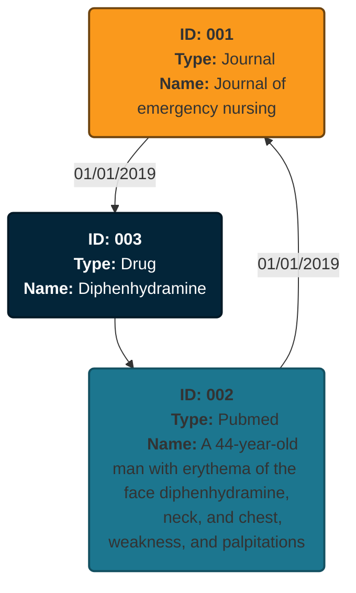

# Test technique DE Servier

> **Auteur:** Alexandre Bidon
> Data Engineer @ LittleBigCode

- [Test technique DE Servier](#test-technique-de-servier)
  - [Partie 1: Python et Data Engineering](#partie-1-python-et-data-engineering)
    - [Format du résultat JSON](#format-du-résultat-json)
      - [Première version](#première-version)
      - [Deuxième version](#deuxième-version)
        - [Exemple](#exemple)
      - [Troisième version](#troisième-version)
        - [Exemple](#exemple-1)
  - [Partie 2: SQL](#partie-2-sql)
    - [Première requête](#première-requête)
    - [Deuxième requête](#deuxième-requête)

## Partie 1: Python et Data Engineering

### Format du résultat JSON

#### Première version

Avant de préparer le pipeline de traitement de données, j'ai défini le format du JSON de sortie. Ma première version se présentait de la manière suivante:

```JSON
{
    "name": "graphe médicament servier",
    "date": "date de l'output",
    "nodes": [
        {
            // Le type de la node
            // journal | pubmed | drug | clinical_trial
            "type": "", 
            // Le nom de la node, dépend du type de la node
            // Le titre du journal | Le nom de la publication | Le nom du médicament | Le nom de l'essai clinique
            "name": ""
        }
    ],
    "links": [
        {
            "from": "",
            "to": "",
            // La date de la mention
            "date": ""
        }
    ]
}
```

Ce format convient pour l'exercice, il est simple à mettre en place. Cependant, il comporte de nombreux défauts:

- Le format ne scale pas très bien avec un grand nombre de nodes et de links
- Les nodes n'ont pas d'identifiant unique, deux nodes pourraient avoir le même nom et elles seraient alors indistinguable.
- La recherche de lien entre plusieurs nodes serait longue et fastidieuse. Il faudrait traverser toute la liste des *links* pour trouver les liens des nodes concernées.
- Les liens entre les *Drugs* et les *PubMeds* / *Clinical trials* n'ont pas de date. On mélange donc des liens avec des formats différents. Le format n'est pas robuste et ne scale pas bien.

J'ai donc modifié mon format afin de répondre à ces différents problèmes.

#### Deuxième version

Cet deuxième version a été concu pour scale avec un plus grand nombre de node et pour faciliter l'idenfication d'une node. Toutes les nodes ont désormais un ID unique. Les liens des nodes sont directements référencés dans celle-ci. Il est donc plus facile de naviguer de node en node.

```JSON
{
    "name": "graphe médicament servier",
    "date": "date de l'output",
    "nodes": [
        {
            // Le type de la node
            // journal | pubmed | drug | clinical_trial
            "type": "", 
            // Identifiant de la node
            "id": "",
            // Le nom de la node, dépend du type de la node
            // Le titre du journal | Le nom de la publication | Le nom du médicament | Le nom de l'essai clinique
            "label": "",
            //
            "ref": [
                {
                    "id": "L'id de la node",
                    // La date de la mention
                    "date": ""
                }
            ]
        }
    ]
}
```

##### Exemple

Pour illustrer le choix du format, j'ai réalisé un output d'exemple:

```JSON
{
    "name": "graphe médicament servier",
    "date": "01/02/2024",
    "nodes": [
        {
            "type": "journal", 
            "id": "001",
            "label": "Journal of emergency nursing",
            "ref": [
                {
                    "id": "003",
                    "date": "01/01/2019"
                }
            ]
        },
        {
            "type": "pubmed", 
            "id": "002",
            "label": "A 44-year-old man with erythema of the face diphenhydramine, neck, and chest, weakness, and palpitations",
            "ref": [
                {
                    "id": "001",
                    "date": "01/01/2019"
                }
            ]
        },
        {
            "type": "drug", 
            "id": "003",
            "label": "Diphenhydramine",
            "ref": [
                {
                    "id": "002"
                }
            ]
        }
    ]
}
```

Cet exemple peut être représenté de la manière suivante:



Cette version apporte des améliorations par rapport à la première, mais il est encore possible de l'améliorer.

#### Troisième version

dfsfs

##### Exemple

sdfsdfsd

## Partie 2: SQL

### Première requête

Cette première requête SQL doit permettre de trouver le chiffre d’affaires jour par jour, du 1er janvier 2019 au 31 décembre 2019.

On travaille sur la table *TRANSACTION* qui contient toutes les ventes et leur montant.

```sql
SELECT date,
       SUM(prod_price * prod_qty) AS  ventes 
FROM TRANSACTION 
WHERE date>='01/01/19' and date<='31/12/19' 
GROUP BY date;
```

On multiplie les colonnes *prod_price* et *prod_qty* pour obtenir le montant total d'une commande. On additionne ensuite le résultat pour obtenir le chiffre d'affaires total (**SUM**) d'une journée (**GROUP BY**). On cadre la requête sur la période du 1er janvier 2019 au 31 décembre 2019 à l'aide du **WHERE date>="01/01/19" and date<="31/12/19"**.

### Deuxième requête

Cette deuxième requête doit permettre de déterminer, par client et sur la période allant du 1er janvier 2019 au 31 décembre 2019, les ventes meuble et déco réalisées.

```sql
SELECT client_id, 
       SUM(CASE WHEN product_type = 'MEUBLE' THEN prod_price * prod_qty ELSE 0 END) AS ventes_meuble,
       SUM(CASE WHEN product_type = 'DECO' THEN prod_price * prod_qty ELSE 0 END) AS ventes_deco
FROM TRANSACTION
INNER JOIN PRODUCT_NOMENCLATURE ON TRANSACTION.prod_id = PRODUCT_NOMENCLATURE.product_id
WHERE date>='01/01/19' and date<='31/12/19' 
GROUP BY client_id;
```

On utilise des sommes avec conditions (**CASE**) pour séparer les montants déco et meuble. On réalise une jointure sur les deux tables pour obtenir toutes les informations nécessaires sur les commandes. On regroupe enfin par les montants par client (client_id).
