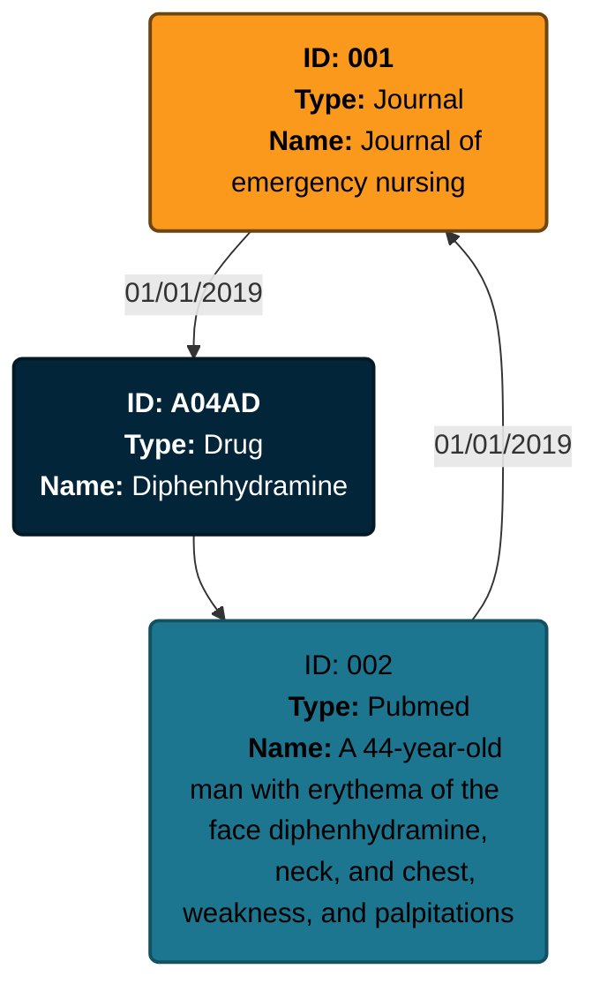

# Format du résultat JSON

[Retour au menu](./00_menu.md)

- [Format du résultat JSON](#format-du-résultat-json)
  - [Première version](#première-version)
  - [Deuxième version](#deuxième-version)
    - [Exemple](#exemple)
  - [Troisième version (finale)](#troisième-version-finale)
    - [Exemple](#exemple-1)

## Première version

Avant de préparer le pipeline de traitement de données, j'ai défini le format du JSON de sortie. Ma première version se présentait de la manière suivante:

```JSON
{
    "name": "graphe médicament servier",
    "date": "date de l'output",
    "nodes": [
        {
            // Le type de la node
            // journal | pubmed | drug | clinical_trial
            "type": "", 
            // Le nom de la node, dépend du type de la node
            // Le titre du journal | Le nom de la publication | Le nom du médicament | Le nom de l'essai clinique
            "name": ""
        }
    ],
    "links": [
        {
            "from": "",
            "to": "",
            // La date de la mention
            "date": ""
        }
    ]
}
```

Ce format convient pour l'exercice, il est simple à mettre en place. Cependant, il comporte de nombreux défauts:

- Le format ne scale pas très bien avec un grand nombre de nodes et de links
- Les nodes n'ont pas d'identifiant unique, deux nodes pourraient avoir le même nom et elles seraient alors indistinguable.
- La recherche de lien entre plusieurs nodes serait longue et fastidieuse. Il faudrait traverser toute la liste des *links* pour trouver les liens des nodes concernées.
- Les liens entre les *Drugs* et les *PubMeds* / *Clinical trials* n'ont pas de date. On mélange donc des liens avec des formats différents. Le format n'est pas robuste et ne scale pas bien.

J'ai donc modifié mon format afin de répondre à ces différents problèmes.

## Deuxième version

Cet deuxième version a été concu pour scale avec un plus grand nombre de node et pour faciliter l'idenfication d'une node. Toutes les nodes ont désormais un ID unique. Les liens des nodes sont directements référencés dans celle-ci. Il est donc plus facile de naviguer de node en node.

```JSON
{
    "name": "graphe médicament servier",
    "date": "date de l'output",
    "nodes": [
        {
            // Le type de la node
            // journal | pubmed | drug | clinical_trial
            "type": "", 
            // Identifiant de la node
            "id": "",
            // Le nom de la node, dépend du type de la node
            // Le titre du journal | Le nom de la publication | Le nom du médicament | Le nom de l'essai clinique
            "label": "",
            //
            "ref": [
                {
                    "id": "L'id de la node",
                    // La date de la mention
                    "date": ""
                }
            ]
        }
    ]
}
```

### Exemple

Pour illustrer le choix du format, j'ai réalisé un output d'exemple:

```JSON
{
    "name": "graphe médicament servier",
    "date": "01/02/2024",
    "nodes": [
        {
            "type": "journal", 
            "id": "001",
            "label": "Journal of emergency nursing",
            "ref": [
                {
                    "id": "A04AD",
                    "date": "01/01/2019"
                }
            ]
        },
        {
            "type": "pubmed", 
            "id": "002",
            "label": "A 44-year-old man with erythema of the face diphenhydramine, neck, and chest, weakness, and palpitations",
            "ref": [
                {
                    "id": "001",
                    "date": "01/01/2019"
                }
            ]
        },
        {
            "type": "drug", 
            "id": "A04AD",
            "label": "Diphenhydramine",
            "ref": [
                {
                    "id": "002"
                }
            ]
        }
    ]
}
```

Cet exemple peut être représenté de la manière suivante:



Cette version apporte des améliorations par rapport à la première, mais il est encore possible de l'améliorer.

## Troisième version (finale)

Pour cette troisième et dernière version, l'objectif a été d'améliorer les performances lors du parcours du graphe. Les élèments ont désormais un ID interne qui diffère de l'ID des données d'origines. Tous les objets ont un attribut "metadata" qui contient les informations spécifiques à celui-ci. Le format des métadatas dépend du type d'objet en entrée.

On a alors le format suivant:

```JSON
{
    "name": "graphe médicament servier",
    "date": "date de l'output",
    "nodes": {
        "Internal-ID": {
            // Le type de la node
            // journal | pubmed | drug | clinical_trial
            "type": "", 

            "metadata": {
                // Dépend du type de la node
            },
            "ref": [
                {
                    "id": "L'id interne de la node",
                    // La date de la mention
                    "date": ""
                }
            ]
        }
    }
}
```

Ici l'attribut "metadata" peut avoir les formats suivants:


**Format "journal"**

```JSON
{
    "title": ""
}
```

---
**Format "pubmed"**

```JSON
{
    "id": "",
    "title": ""
}
```

---
**Format "drug"**

```JSON
{
    "atccode": "",
    "drug": ""
}
```

---
**Format "clinical_trials"**

```JSON
{
    "id":"",
    "scientific_title":""
}
```

---

> [!IMPORTANT]  
> L'ajout d'un identifiant interne peut sembler lourd et superflus. En effet, la plupart des ressources disposent déjà d'un ID dans les données d'origines.
> 
> Cependant, les formats d'ID sont tous différents. Rien ne garanti que les sources de données différentes ne renvoie un même identifiant pour des objets différents. Sur un jeu de données plus gros (en production), la probabilité d'une collision serait élevée et risquerait de casser l'intégrité des données.
> 
> Je suppose dans notre cas que les identifiants présents dans les données d'origines (atccode,id) pourraient être des informations utiles et importantes. Il est donc nécessaire de les conserver dans le JSON final. Ils ne seront pas contre pas utilisés pour identifier et indexer les objets.

> [!NOTE]
> Le paramètre metadata permet d'avoir des objets avec des paramètres différents. Lorsque l'on arrive sur une node, on peut lire son type pour connaitre le format des metadata. Il sera aussi possible de facilement mettre à jour ce paramètre. On pourrait par exemple rajouter des informations sur les journaux à l'aide de nouveaux paramètres dans les metadata.

On utilisera ici des UUIDs pour la génération des ID internes. Cela permettra de minimiser très fortement le risque de collision ([voir cet exemple](https://devina.io/collision-calculator)).

### Exemple

On reprend l'exemple précédent. Ici, le JSON aurait le format suivant:

```JSON
{
    "name": "graphe médicament servier",
    "date": "01/02/2024",
    "nodes": {
        "00000000-0000-0000-0000-00000000001": {
            "type": "journal", 
            "metadata": {
                "title": "Journal of emergency nursing"
            },
            "ref": [
                {
                    "id": "00000000-0000-0000-0000-00000000003",
                    "date": "01/01/2019"
                }
            ]
        },
        "00000000-0000-0000-0000-00000000002": {
            "type": "pubmed", 
            "metadata": {
                "id": "",
                "title": "A 44-year-old man with erythema of the face diphenhydramine, neck, and chest, weakness, and palpitations"
            },
            "ref": [
                {
                    "id": "00000000-0000-0000-0000-00000000001",
                    "date": "01/01/2019"
                }
            ]
        },
        "00000000-0000-0000-0000-00000000003": {
            "type": "drug", 
            "metadata": {
                "atccode": "A04AD",
                "drug": "Diphenhydramine"
            },
            "ref": [
                {
                    "id": "00000000-0000-0000-0000-00000000002"
                }
            ]
        }
    }
}
```
